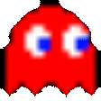
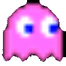
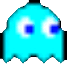
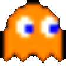
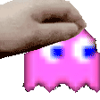

# 👻 SVG-Pacman-Contributions

Transforme seu gráfico de contribuições do GitHub em um jogo animado de Pac-Man! Veja como o Pac-Man devora suas contribuições enquanto desvia dos fantasmas em uma experiência nostálgica de arcade.

<picture>
  <source media="(prefers-color-scheme: dark)"
          srcset="https://raw.githubusercontent.com/AndreRuperto/AndreRuperto/output/dist/pacman-contribution-graph-dark.svg">
  
</picture>

Esta versão se concentra especificamente na geração de animações SVG otimizadas, com melhorias significativas na jogabilidade e na aparência visual.

## 🎮 Funcionalidades

- **Integração com GitHub**: Busca automaticamente seus dados de contribuição via API GraphQL
- **Jogabilidade do Pac-Man**: Mecânicas clássicas do Pac-Man onde commits são pontos comestíveis
- **Animação SVG Aprimorada**: Exporta um SVG animado com melhorias visuais e comportamentais
- **GitHub Action**: Fácil de adicionar ao README do seu perfil ou site
- **Múltiplos Temas**: Suporta temas GitHub claro/escuro e GitLab claro/escuro

## 🚀 Como Usar

### GitHub Action

- O arquivo YAML deve ser criado no caminho .github/workflows/pacman.yml
- Você deve criar uma branch chamada output para o GitHub armazenar os SVGs gerados

```yaml
name: Atualizar Pac-Man Contribution

on:
  schedule:
    - cron: "0 0 * * *"         # Executa diariamente à meia-noite
  workflow_dispatch:            # Permite execução manual

jobs:
  build:
    permissions:
      contents: write
    runs-on: ubuntu-latest
    timeout-minutes: 5

    steps:
      - uses: actions/checkout@v3

      - name: Criar diretório dist
        run: mkdir -p dist

      - name: Gerar gráfico de contribuições estilo Pac-Man
        uses: AndreRuperto/svg-pacman-contributions@main
        with:
          github_user_name: ${{ github.repository_owner }}
          github_token: ${{ secrets.GITHUB_TOKEN }}
          theme: github-dark
          output_directory: dist
          player_style: oportunista

      - name: Publicar SVG na branch output
        uses: crazy-max/ghaction-github-pages@v3.1.0
        with:
          target_branch: output
          build_dir: dist
        env:
          GITHUB_TOKEN: ${{ secrets.GITHUB_TOKEN }}
```

## ⏳ Executar o Workflow Manualmente
Depois de configurar tudo:

- Vá para a aba "Actions" no seu repositório
- Clique em "Atualizar Pac-Man Contribution"
- Clique em "Run workflow" > "Run workflow"

Isso iniciará o processo de geração do SVG e depois você poderá ver a animação funcionando no seu README!
Essa implementação permitirá que seu gráfico de contribuições do Pac-Man seja atualizado automaticamente todos os dias, mantendo-o sempre atual com suas contribuições mais recentes.


## 📄 Adicionando o SVG ao README

```markdown
<picture>
  <source media="(prefers-color-scheme: dark)" srcset="https://raw.githubusercontent.com/AndreRuperto/AndreRuperto/output/pacman-contribution-graph-dark.svg">
  <source media="(prefers-color-scheme: light)" srcset="https://raw.githubusercontent.com/AndreRuperto/AndreRuperto/output/pacman-contribution-graph.svg">
  
</picture>
```

## 🎯 Como Funciona

A aplicação usa seus dados de contribuição do GitHub para:

1. Criar uma grade onde cada célula representa um dia de contribuição
2. Utilizar os níveis de intensidade de contribuição fornecidos pela API do GitHub:

- NONE: Dias sem contribuições (espaços vazios no jogo)
- FIRST_QUARTILE: Dias com poucas contribuições (pontos pequenos, 1 ponto no jogo)
- SECOND_QUARTILE: Dias com contribuições moderadas (pontos médios, 2 pontos)
- THIRD_QUARTILE: Dias com muitas contribuições (pontos grandes, 5 pontos)
- FOURTH_QUARTILE: Dias com contribuições excepcionais (power pellets que ativam o modo de comer fantasmas)

Esses níveis são relativos ao padrão de contribuições de cada usuário e calculados automaticamente pelo GitHub, portanto a densidade de elementos no jogo refletirá o perfil único de cada um.

3. Pac-Man navega pela grade usando algoritmos de pathfinding
4. Fantasmas perseguem o Pac-Man com comportamentos únicos (como no jogo original)
5. Toda a jogabilidade é gravada e exportada como um SVG animado

## 📋 Opções de Configuração

| Opção           | Descrição                               | Padrão         | Valores Possíveis                            |
|----------------|------------------------------------------|----------------|-----------------------------------------------|
| `username`     | Nome de usuário do GitHub                | (obrigatório)  | Qualquer nome de usuário válido do GitHub     |
| `theme`        | Tema de cores                            | `github-dark`  | `github`, `github-dark`                       |
| `outputDirectory` | Pasta de saída do SVG                 | `dist`         | Qualquer string válida para caminho local     |
| `githubToken`  | Token do GitHub para acesso à API        | `GITHUB_TOKEN` | Token pessoal válido (com permissão de leitura pública) |
| `playerStyle`  | Estilo do Pacman                         | `oportunista`  | `oportunista`, `agressivo`, `conservador`     |

## 🧩 Melhorias Implementadas

Esta versão inclui várias melhorias em relação à implementação original:

- **Fantasmas Aprimorados**: Novas imagens e animações mais fiéis ao jogo original
- **Olhos Direcionais**: Os olhos dos fantasmas se movem de acordo com a direção em que estão indo
- **Power-up Aperfeiçoado**: Melhor lógica e feedback visual durante o modo de power-up
- **Casa dos Fantasmas**: Design melhorado para a área inicial dos fantasmas
- **Otimização SVG**: Geração de SVG mais eficiente e com animações mais suaves
- **Estilos de Jogabilidade do Pac-Man**: Três diferentes comportamentos configuráveis:
  - **Oportunista** (padrão): Equilibra a busca por pontos e a segurança. O Pac-Man avalia tanto o perigo dos fantasmas quanto as recompensas das contribuições, tomando decisões balanceadas.
  - **Agressivo**: Prioriza a coleta de pontos mesmo com fantasmas próximos. Ignora parcialmente o perigo e foca em maximizar a pontuação, criando uma animação mais dinâmica e arriscada.
  - **Conservador**: Extremamente cauteloso, prioriza a sobrevivência acima de tudo. Evita ativamente áreas com fantasmas mesmo que contenha muitos pontos, resultando em um jogo mais longo e seguro.

## 👻 Fantasmas atualizados
Cada fantasma ganhou novas imagens e personalidades fiéis aos do jogo original.

| Fantasma | Pré-visualização | Comportamento |
|:--------:|:----------------:|:-------------|
| **Blinky** (vermelho) | <p align="center"></p> | Perseguidor agressivo que mira diretamente no Pac-Man. Fica mais rápido quando restam poucos pontos no mapa, o que os jogadores chamam de "modo Elroy". |
| **Pinky** (rosa) | <p align="center"></p> | Estrategista que tenta emboscar o Pac-Man se posicionando 4 casas à frente da direção atual dele. É especialista em armadilhas e emboscadas. |
| **Inky** (ciano) | <p align="center"></p> | Imprevisível e complexo. Usa a posição do Blinky como referência para seu movimento, calculando um vetor que passa pelo Pac-Man e depois dobrando essa distância. |
| **Clyde** (laranja) | <p align="center"></p> | Tímido e errático. Persegue o Pac-Man quando está longe, mas quando se aproxima a menos de 8 casas de distância, foge para seu canto. Esse comportamento "tímido" o torna menos previsível. |

## 🔧 Desenvolvimento

Construído com TypeScript e Node.js, o projeto consiste em:

- `src/`: Lógica principal do jogo e renderização
- `scripts/`: Ferramentas para gerar SVGs
- `github-action/`: Integração com GitHub Action

## 🙏 Créditos

Este projeto é uma versão especializada baseada no [Pac-Man Contribution Graph](https://github.com/abozanona/pacman-contribution-graph) criado por [abozanona](https://github.com/abozanona). Enquanto o projeto original oferece tanto visualizações SVG quanto Canvas, esta versão foca exclusivamente em melhorias à renderização SVG e na experiência de jogabilidade automatizada.

## 🤝 Como contribuir
Ficou com vontade de adicionar um novo tema, melhorar a IA dos fantasmas ou otimizar o SVG?  
Pull requests são **muito** bem-vindos!  

1. **Fork** o repositório  
2. Crie sua branch: `git checkout -b feat/minha-melhoria`  
3. Faça commits claros e concisos  
4. Abra um PR explicando o que mudou e _por quê_  

Se tiver dúvidas, abra uma _issue_. 👊

---

<p align="center">
  Esses fantasmas trabalham muito! Deixe um cafuné antes de sair.<br>
  
</p>